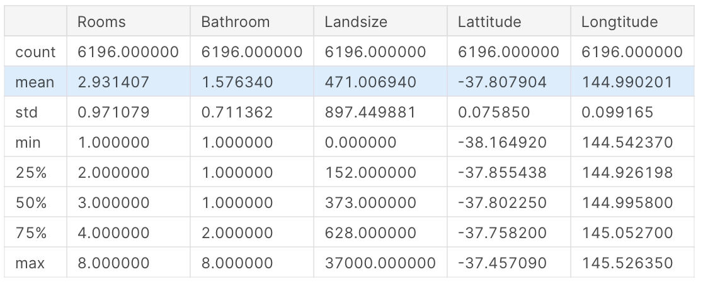
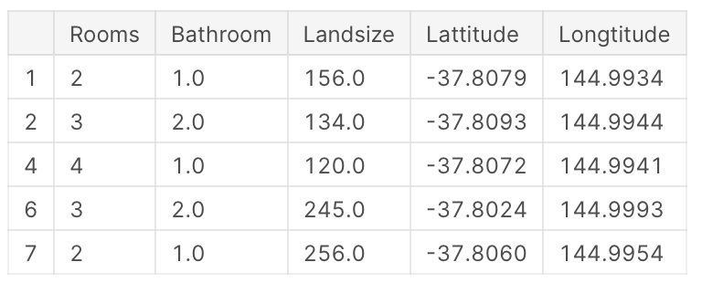

# Intro to Machine Learning

[3. Your First Machine Learning Model](#3.-Your-First-Machine-Learning-Model)
*  [Selecting Data for Modeling](#Selecting-Data-for-Modeling)
*  [Procedure of Machine Learning Model](#Procedure-of-Machine-Learning-Model)
    *  [Step 1 - Select The Prediction Target](#Step-1---Select-The-Prediction-Target)
    *  [Step 2 - Create X](#Step-2---Create-X)
    *  [Step 3 - Specify and Fit Model](#Step-3---Specify-and-Fit-Model)
    
[4. What is Model Validation](#4.-What-is-Model-Validation)

[5. Underfitting and Overfitting](#5.-Underfitting-and-Overfitting)
*  [Function:-Get Mean Absolute Error](#Function:-Get-Mean-Absolute-Error)
*  [Step 1 - Compare Different Tree Sizes](#Step-1---Compare-Different-Tree-Sizes)
*  [Step 2 - Fit Model Using All Data](#Step-2---Fit-Model-Using-All-Data)


## 3. Your First Machine Learning Model

### Selecting Data for Modeling

    import pandas as pd
    
    melbourne_file_path = '../input/melbourne-housing-snapshot/melb_data.csv'
    melbourne_data = pd.read_csv(melbourne_file_path) 
    melbourne_data.columns

Out

    Index(['Suburb', 'Address', 'Rooms', 'Type', 'Price', 'Method', 'SellerG',
           'Date', 'Distance', 'Postcode', 'Bedroom2', 'Bathroom', 'Car',
           'Landsize', 'BuildingArea', 'YearBuilt', 'CouncilArea', 'Lattitude',
           'Longtitude', 'Regionname', 'Propertycount'],
          dtype='object')

    # The Melbourne data has some missing values (some houses for which some variables weren't recorded.)
    # We'll learn to handle missing values in a later tutorial.  
    # Your Iowa data doesn't have missing values in the columns you use. 
    # So we will take the simplest option for now, and drop houses from our data. 
    # Don't worry about this much for now, though the code is:
    
    # dropna drops missing values (think of na as "not available")
    melbourne_data = melbourne_data.dropna(axis=0)

### Procedure of Machine Learning Model

1. use **Dot notation** to select "prediction target"
2. extract column list to select "features"

#### Step 1 - Select The Prediction Target

- pull out a variable with **dot-notation,** the single column is stored in a **Series.**

    y = melbourne_data.Price

#### Step 2 - Create X

- The columns that are inputted into our model (and later used to make predictions) are called "features".
- create a DataFrame called X holding the predictive features

    melbourne_features = ['Rooms', 'Bathroom', 'Landsize', 'Lattitude', 'Longtitude']
    X = melbourne_data[melbourne_features]
    X.describe()
    
<p align="center"></p>

    X.head()

<p align="center"></p>

#### Step 3 - Specify and Fit Model

- use **scikit-learn** library to create the model (sklearn)
- Scikit-learn is easily the most popular library for modeling the types of data typically stored in DataFrames

The steps to building and using a model are:

- **Define:** What type of model will it be? A decision tree? Some other type of model? Some other parameters of the model type are specified too.
- **Fit:** Capture patterns from provided data. This is the heart of modeling.
- **Predict:** Just what it sounds like
- **Evaluate**: Determine how accurate the model's predictions are.

    ```from sklearn.tree import DecisionTreeRegressor
    
    # Define model. Specify a number for random_state to ensure same results each run
    melbourne_model = DecisionTreeRegressor(random_state=1)
    
    # Fit model
    melbourne_model.fit(X, y)

    DecisionTreeRegressor(criterion='mse', max_depth=None, max_features=None,
                          max_leaf_nodes=None, min_impurity_decrease=0.0,
                          min_impurity_split=None, min_samples_leaf=1,
                          min_samples_split=2, min_weight_fraction_leaf=0.0,
                          presort=False, random_state=1, splitter='best')```

`random_state` : specify a number to get the same result in each run (can be any number)

    print("Making predictions for the following 5 houses:")
    print(X.head())
    print("The predictions are")
    print(melbourne_model.predict(X.head()))

    Making predictions for the following 5 houses:
       Rooms  Bathroom  Landsize  Lattitude  Longtitude
    1      2       1.0     156.0   -37.8079    144.9934
    2      3       2.0     134.0   -37.8093    144.9944
    4      4       1.0     120.0   -37.8072    144.9941
    6      3       2.0     245.0   -37.8024    144.9993
    7      2       1.0     256.0   -37.8060    144.9954
    The predictions are
    [1035000. 1465000. 1600000. 1876000. 1636000.]

## 4. What is Model Validation

- Many ppl make a huge mistake when measuring predictive accuracy. They compare predictions with training set to the target values in the same set. (← high variance (overfitting)?)
- There are many metrics for summarising model quality, but start with **Mean Absolute Error** (MAE)

    `error = actual − predicted`

    *Example*

    To calculate MAE, we first need a model.

        # Data Loading Code Hidden Here
        import pandas as pd
        
        # Load data
        melbourne_file_path = '../input/melbourne-housing-snapshot/melb_data.csv'
        melbourne_data = pd.read_csv(melbourne_file_path) 
        # Filter rows with missing price values
        filtered_melbourne_data = melbourne_data.dropna(axis=0)
        # Choose target and features
        y = filtered_melbourne_data.Price
        melbourne_features = ['Rooms', 'Bathroom', 'Landsize', 'BuildingArea', 
                                'YearBuilt', 'Lattitude', 'Longtitude']
        X = filtered_melbourne_data[melbourne_features]
        
        from sklearn.tree import DecisionTreeRegressor
        # Define model
        melbourne_model = DecisionTreeRegressor()
        # Fit model
        melbourne_model.fit(X, y)

    Calculate the Mean Absolute Error

        from sklearn.metrics import mean_absolute_error
        
        predicted_home_prices = melbourne_model.predict(X)
        mean_absolute_error(y, predicted_home_prices)

        434.71594577146544

## Validation Data

    - Refer to deeplearning.ai, in this note we focus on how to code it

        ```from sklearn.model_selection import train_test_split
        
        # split data into training and validation data, for both features and target
        # The split is based on a random number generator. Supplying a numeric value to
        # the random_state argument guarantees we get the same split every time we
        # run this script.
        train_X, val_X, train_y, val_y = train_test_split(X, y, random_state = 0)
        # Define model
        melbourne_model = DecisionTreeRegressor()
        # Fit model
        melbourne_model.fit(train_X, train_y)
        
        # get predicted prices on validation data
        val_predictions = melbourne_model.predict(val_X)
        print(mean_absolute_error(val_y, val_predictions))```

        ```259556.7211103938```

## 5. Underfitting and Overfitting

- In deeplearning.ai, the way Andrew Ng explained was in mathematical approach
- Here the decision tress is used as example to explain underfitting and overfitting, using house price prediction as example
- Overfitting: Leaves with very few houses → prediction closer to those homes' actual values → unreliable predicts for new data (too specified)
- Underfitting: Leaves with many houses → resulting predictions far off for most houses even in training data (too general)

<p align="center"></p>

### Previous Model

    # Code you have previously used to load data
    import pandas as pd
    from sklearn.metrics import mean_absolute_error
    from sklearn.model_selection import train_test_split
    from sklearn.tree import DecisionTreeRegressor
    
    
    # Path of the file to read
    iowa_file_path = '../input/home-data-for-ml-course/train.csv'
    
    home_data = pd.read_csv(iowa_file_path)
    # Create target object and call it y
    y = home_data.SalePrice
    # Create X
    features = ['LotArea', 'YearBuilt', '1stFlrSF', '2ndFlrSF', 'FullBath', 'BedroomAbvGr', 'TotRmsAbvGrd']
    X = home_data[features]
    
    # Split into validation and training data
    train_X, val_X, train_y, val_y = train_test_split(X, y, random_state=1)
    
    # Specify Model
    iowa_model = DecisionTreeRegressor(random_state=1)
    # Fit Model
    iowa_model.fit(train_X, train_y)
    
    # Make validation predictions and calculate mean absolute error
    val_predictions = iowa_model.predict(val_X)
    val_mae = mean_absolute_error(val_predictions, val_y)
    print("Validation MAE: {:,.0f}".format(val_mae))
    
    # Set up code checking
    from learntools.core import binder
    binder.bind(globals())
    from learntools.machine_learning.ex5 import *
    print("\nSetup complete")

### Function: Get Mean Absolute Error

- `DecisionTreeRegressor` has one more attribute `max_leaf_nodes=max_leaf_nodes`

    def get_mae(max_leaf_nodes, train_X, val_X, train_y, val_y):
        model = DecisionTreeRegressor(max_leaf_nodes=max_leaf_nodes, random_state=0)
        model.fit(train_X, train_y)
        preds_val = model.predict(val_X)
        mae = mean_absolute_error(val_y, preds_val)
        return(mae)

### Step 1 - Compare Different Tree Sizes

- use `get_mae` on each value of max_leaf_nodes
- use  dictionary to store `leaf_nodes` as key, `node_mae` as value

    candidate_max_leaf_nodes = [5, 25, 50, 100, 250, 500]
    # Write loop to find the ideal tree size from candidate_max_leaf_nodes
    node_dict = {}
    for leaf_nodes in candidate_max_leaf_nodes:
        node_mae = get_mae(leaf_nodes, train_X, val_X, train_y, val_y)
        node_dict.update({leaf_nodes : node_mae})
        #print("Max leaf nodes: %d \t\t Mean Absolute Error: %d" %(leaf_nodes, node_mae))
        
    print(node_dict)
    
    # Store the best value of max_leaf_nodes (it will be either 5, 25, 50, 100, 250 or 500)
    best_tree_size = min(node_dict, key=node_dict.get)
    
    # Check your answer
    step_1.check()

### Step 2 - Fit Model Using All Data

    # Fill in argument to make optimal size and uncomment
    final_model = DecisionTreeRegressor(max_leaf_nodes=best_tree_size, random_state=0)
    
    # fit the final model and uncomment the next two lines
    final_model.fit(train_X, train_y)
    
    # Check your answer
    step_2.check()

## 6. Random Forests

## 7. Exercise: Machine Learning Competitions
